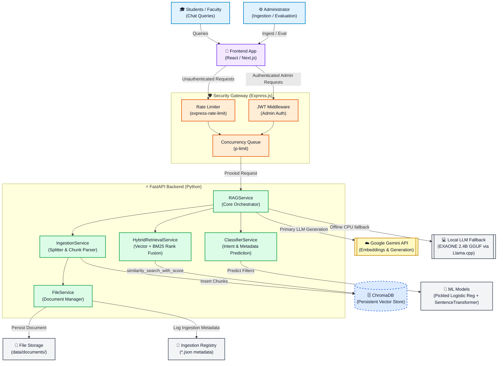
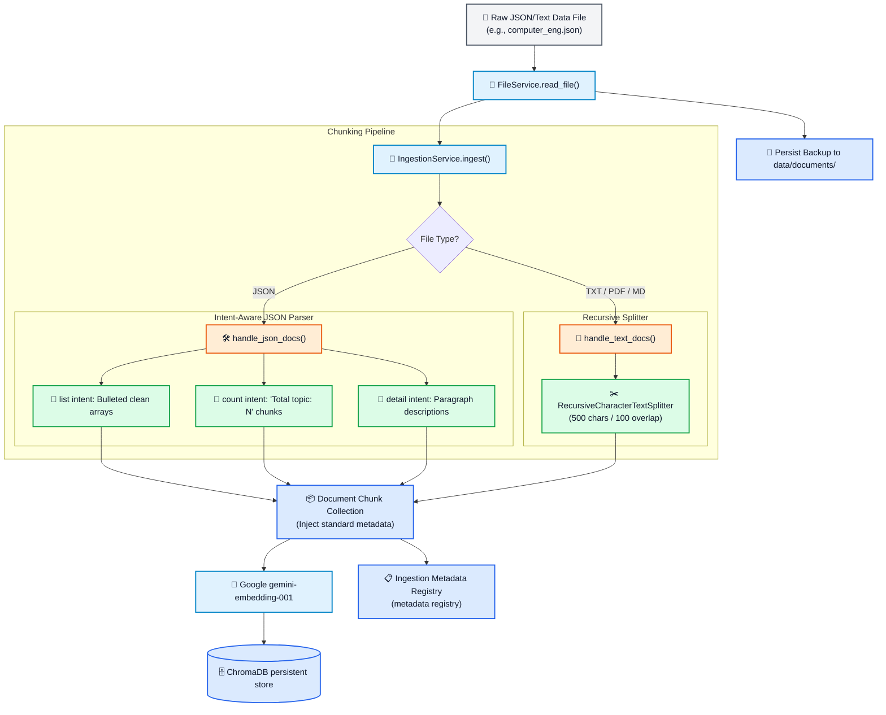
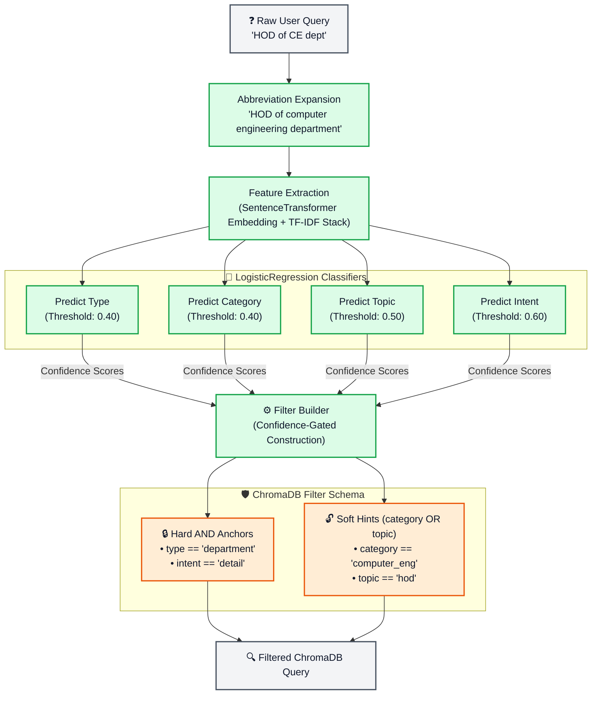

## Built a University RAG Chatbot: Intent-Aware Retrieval, ML-Guided Filtering & Resilient Local Fallbacks
I built this production-ready **Retrieval-Augmented Generation (RAG)** chatbot to help students, faculty, and visitors query university department profiles, faculty rosters, lab facilities, and course syllabi in natural English.
Most basic RAG setups struggle in production: they hallucinate details, pull in off-topic information (like confusing a Computer Science HOD with an IT HOD because the queries sound so similar), or break down when cloud APIs hit rate limits or go offline. To fix these issues, I designed an advanced, highly specialized retrieval pipeline. 

---
## 🌟 The Project & Key Features
This chatbot isn't just a basic wrapper around an LLM. It's a complete, production-grade application equipped with features designed for speed, accuracy, and reliability.
### Core Features:
*   **Dual-LLM Resiliency Backend:** Uses cloud-based **Google Gemini 2.5 Flash Lite** for lightning-fast, high-quality responses under normal conditions. If internet access is lost, it automatically hot-swaps to an offline, quantized **EXAONE-3.5-2.4B** model running locally on the CPU.
*   **Full CRUD Vector Administration:** Exposes robust API endpoints for administrators to upload documents, update existing chunk metadata, delete records, and manage vector indices dynamically.
*   **Hybrid Search Pipeline:** Fuses dense semantic vector embeddings with sparse, keyword-focused lexical search (BM25) to satisfy both broad conceptual queries and exact phrase matches.
*   **Built-in Evaluation Suite:** Includes batch testing endpoints that mathematically evaluate retrieval quality (MRR, Hit Rate, Noise Rate) and classification accuracy (F1-score, Precision, Recall).
### 📊 Quick Technical Stats:
*   **~85% Routing Accuracy:** Query intent and category classification accuracy.
*   **~0.90 Mean Reciprocal Rank (MRR):** Retrieval rank performance.
*   **Zero-Downtime Fallback:** Instant failover to local CPU-bound inference.
---
## 🗺️ How the System Fits Together
To make the architecture clean and decoupled, I divided the system into two major boundaries: a lightweight, secure Web Gateway (built in Express.js) that handles public rate limiting and admin JWT verification, and a high-performance FastAPI backend hosting the ML models and retrieval logic.
### 1. High-Level System Architecture

---
## 🛠️ The Ingestion Pipeline (Write Path)
Here is how structured department files and unstructured textbooks are processed and indexed into ChromaDB. For structured files, I designed an **intent-aware splitter** to organize data into semantic, count, and detail groups rather than using raw character slices:

---
## 🧠 The Engineering Behind the Engine
Here is a deep technical breakdown of the architectural solutions I engineered to overcome the limitations of naive RAG:
### 1. Intent-Aware Document Chunking
Splitting documents blindly by character counts destroys structured academic lists (like faculty rosters). 
*   **The Taxonomy:** I modeled university data using a clean, three-level hierarchy:
    **Type** (e.g., `department`)  ➔  **Category** (e.g., `computer_eng`)  ➔  **Topic** (e.g., `faculty` / `lab` / `syllabus`)
*   **Splitter Strategy:** The ingestion engine parses structured files into three intent-specific formats:
    1.  `list`: Pre-formatted bullet points for rosters or course offerings.
    2.  `count`: Synthetic helper chunks (e.g., `"Total faculty members: 15"`) designed specifically to satisfy counting-related queries.
    3.  `detail`: Context-rich paragraphs describing the items in detail.
---
### 2. The ML-Guided Pre-Filter Classifier
To prevent "department bleed"—where vector similarity confuses near-identical queries between different departments (e.g., *"HOD of CE"* vs. *"HOD of IT"*)—I built an offline-trained query routing engine:

*   **Stacked Feature Space:** The classifier represents queries by stacking dense semantic embeddings with sparse word/character TF-IDF vectors:
    ```
    Stacked Feature Vector = [ Dense Sentence-Embedding (384d) || Sparse TF-IDF Vector ]
    ```
*   **Confidence-Gated Filters:** Four separate `LogisticRegression` models predict the query labels. High-confidence predictions are locked in as hard database filters:
    *   *Prediction thresholds (When to label):* `Type: 0.40`, `Category: 0.40`, `Topic: 0.50`, `Intent: 0.60`
    *   *Hard DB Filter thresholds (Confidence check):* `Type: 0.65`, `Category: 0.65`, `Topic: 0.70`
*   **Soft Hints:** Borderline predictions are combined as a soft `OR` condition (`category` OR `topic`) to avoid dropping relevant documents.
*   **Final Filter Mappings:** The query filter is structured dynamically:
    ```
    ChromaDB Filter = Type AND Intent AND (Category OR Topic)
    ```
*   **Uptime Fallback:** If classification confidence drops below the threshold, the system gracefully disables filters and runs a full, unrestricted semantic search.
---
### 3. Zero-Roundtrip Hybrid RRF Search
Running vector databases and lexical search engines (like Elasticsearch) on separate clusters is slow and resource-heavy. I resolved this by engineering a **Zero-DB-Roundtrip Hybrid Pipeline**:
```
                  ┌─────────────────────────────────────────┐
                  │          Raw Ingested Query             │
                  └────────────────────┬────────────────────┘
                                       │
                                       ▼
                  ┌─────────────────────────────────────────┐
                  │ 1. Similarity Search with ML Filters    │
                  │    - Fetches top-15 candidate chunks    │
                  └────────────────────┬────────────────────┘
                                       │
                                       ├────────────────────────┐
                                       ▼ (Extract docs)         ▼ (Vector Ranks)
                  ┌─────────────────────────────────────────┐   │
                  │ 2. Dynamic BM25 Retriever               │   │
                  │    - Rebuilds corpus of 15 candidates   │   │
                  │    - Performs fast keyword re-indexing │   │
                  └────────────────────┬────────────────────┘   │
                                       │                        │
                                       ▼ (BM25 Ranks)           │
                  ┌─────────────────────────────────────────┐   │
                  │ 3. Reciprocal Rank Fusion (RRF)         │◄──┘
                  │    - Fuses ranks using weights (60/40)  │
                  └────────────────────┬────────────────────┘
                                       │
                                       ▼
                  ┌─────────────────────────────────────────┐
                  │ 4. Metadata Boost & exact Title Boost   │
                  │    - Multiplies score on classifier hit │
                  │    - Adds +0.1 per word found in title  │
                  └────────────────────┬────────────────────┘
                                       │
                                       ▼
                  ┌─────────────────────────────────────────┐
                  │ 5. Threshold Filter (>=0.4) & Top-5     │
                  └─────────────────────────────────────────┘
```
1.  **Candidate Pull:** A single filtered vector search pulls the top $15$ candidate document chunks from ChromaDB.
2.  **Dynamic BM25 Corpus:** The 15 retrieved candidate documents are dynamically loaded into a temporary BM25 index in memory. BM25 is executed *only* over these 15 candidates, eliminating index scans and extra DB hits.
3.  **Reciprocal Rank Fusion (RRF):** Fuses lexical and semantic ranks based on positioning:
    ```
    RRF_Score(doc) = (w_bm25 * (1 / (k_rrf + rank_bm25))) + (w_vector * (1 / (k_rrf + rank_vector)))
    ```
    *(Weights: BM25 $0.6$, Vector $0.4$, smoothing constant $k_{\text{rrf}} = 60$.)*
4.  **Metadata & Title Boosts:** Fused scores get multiplied by a boost factor ($1.10\times$ to $1.20\times$) on perfect classifier matches. Additionally, we add $+0.1$ for every exact query word found in the document title to prioritize direct headline matches:
    ```
    Final_Score = Fused_Score + (matching_words_in_title * 0.1)
    ```
---
### 4. Dual LLM Backend & Local CPU Fallback
To achieve high availability, the backend manages a robust, local GGUF fallback mechanism:
*   **Cloud Mode:** Uses `gemini-2.5-flash-lite` for blazing-fast generation, high reasoning capability, and clean structured summaries.
*   **Local Failover:** On network error, API timeout, or rate-limit bounds, the orchestrator hot-swaps to a local **EXAONE-3.5-2.4B-Instruct** model running on the CPU via Llama.cpp.
*   **Prompt Adaptation:** The system automatically wraps prompts with specialized syntax designed for small, local parameter spaces, maintaining output accuracy and structure without internet dependencies.
---
### 5. Automated Offline Evaluation Framework
Rather than guessing search quality, I built two mathematical validation metrics directly into the REST API:
*   **Retrieval Evaluation (`POST /api/v1/rag/test`):** Batches expected results to calculate **Hit Rate** and **Mean Reciprocal Rank (MRR)**. It also calculates **Doc Noise Rate** (proportion of incorrect source files retrieved) to measure prompt dilution:
    ```
    MRR = (1 / total_queries) * Sum(1 / rank_of_correct_chunk)
    ```
*   **Classifier Metric Analysis (`POST /api/v1/rag/test_classifier`):** Evaluates classification accuracy using scikit-learn to report precise **Precision**, **Recall**, and **F1-Scores** across all predicted metadata fields.